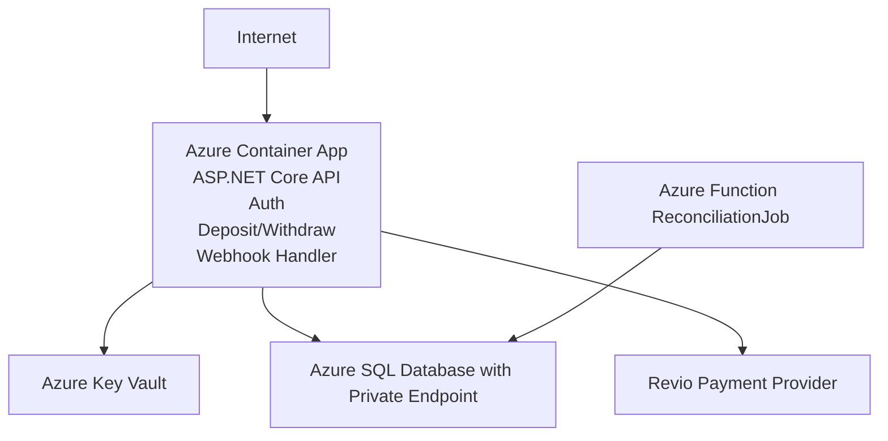
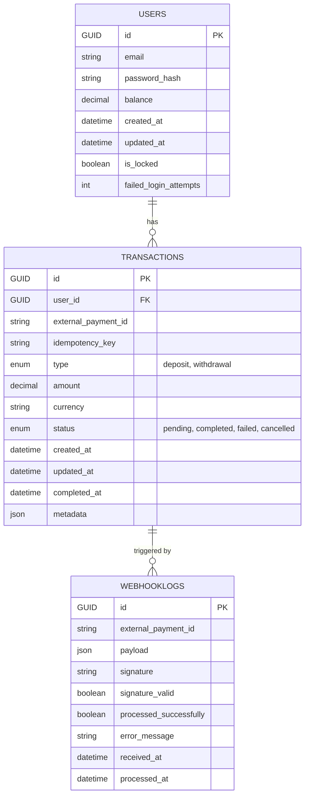
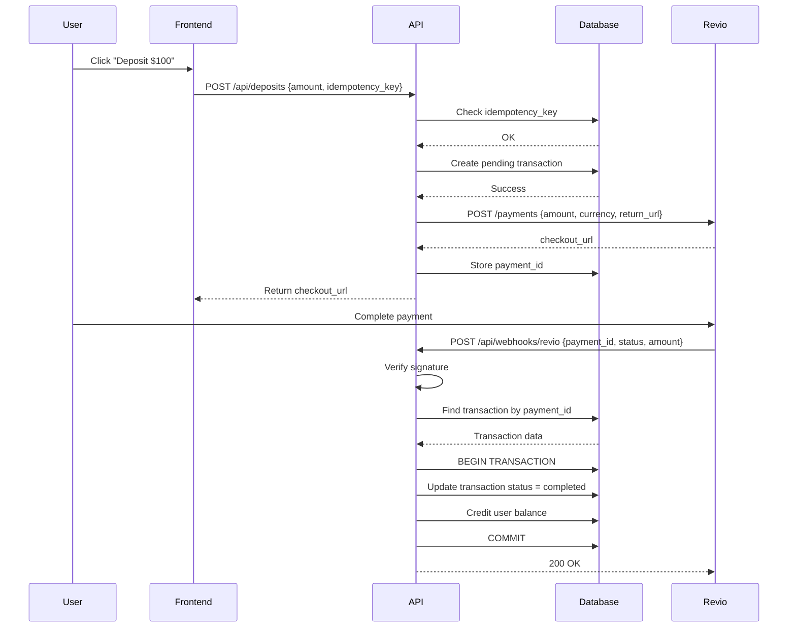
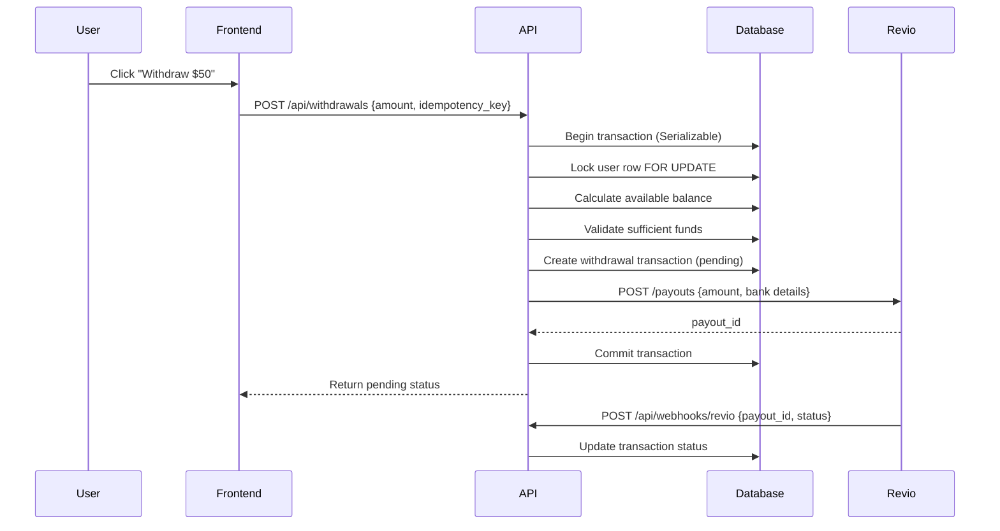
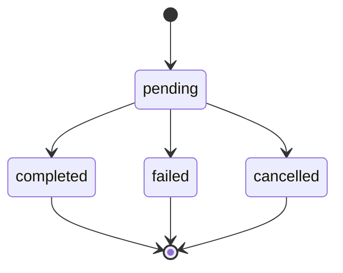

# Octoco Backend Design Document
## Payment System with Deposit & Withdrawal Functionality

**Author:** Chad Chandrapaul
**Date:** October 16, 2025  
**Purpose:** Technical design for a secure, consistent payment management system

---

## 1. Tech Stack

### Core Technologies
- **Language & Framework:** C# with ASP.NET Core 8.0
  - Mature ecosystem with extensive financial services support
  - Strong async/await support for webhook handling
  - Excellent tooling and debugging capabilities
  - Industry standard with large talent pool for scaling teams

- **Database:** Azure SQL Database
  - ACID compliance critical for financial transactions
  - Strong support for row-level locking and transaction isolation
  - Built-in high availability and point-in-time restore
  - Familiar tooling for team onboarding

- **ORM:** Entity Framework Core 8
  - Type-safe queries with LINQ
  - Migration-based schema versioning
  - Built-in connection pooling and transaction management
  - Easy unit testing with InMemory provider

### Azure Infrastructure
- **Compute:** Azure Container Apps
  - Easy horizontal scaling with KEDA
  - Managed infrastructure reduces operational overhead
  - Built-in service discovery and load balancing
  
- **Background Jobs:** Azure Functions (Timer Trigger)
  - Serverless execution for reconciliation tasks
  - Independent scaling from main API
  - Cost-effective for periodic workloads

- **Secrets Management:** Azure Key Vault
  - Centralized secret storage with audit logging
  - Managed Identity integration (no credentials in code)
  - Automatic secret rotation capabilities

- **Monitoring:** Application Insights
  - Distributed tracing for request flows
  - Custom metrics for business KPIs
  - Real-time alerting and dashboards

- **Networking:** Virtual Network with Private Endpoints
  - SQL Database and Key Vault not publicly accessible
  - Defense-in-depth security posture

### Third-Party Services
- **Payment Provider:** Revio (external API)
- **Rate Limiting:** AspNetCoreRateLimit middleware

---

## 2. System Architecture

### Architecture Style: Modular Monolith

**Rationale:**
- Tight transactional boundaries between users and transactions require ACID guarantees
- Small team structure (mentioned senior frontend developer) benefits from simpler deployment
- Easier debugging and operational overhead for intermediate team size
- Can extract services later if specific scaling needs emerge (e.g., webhook processor)

### High-Level Component Diagram





### Authentication & Authorization

**Authentication Flow:**
1. User submits credentials to `POST /api/auth/login`
2. API validates against database (Argon2id hashed passwords)
3. Generate JWT with short expiration (15 minutes)
4. Store in HttpOnly, Secure, SameSite=Strict cookie
5. Issue refresh token (7 days) in separate cookie

**JWT Claims:**
```
- sub: user_id (GUID)
- email: user@example.com
- iat: issued_at timestamp
- exp: expiration timestamp
```

**Authorization:**
- Middleware validates JWT on each request
- Extract user_id from claims for user-scoped operations
- All deposit/withdrawal endpoints require valid authentication
- Webhook endpoint uses signature verification (not JWT)

**Security Features:**
- Rate limiting: 5 login attempts per minute per IP
- Account lockout after 10 failed attempts (15-minute cooldown)
- JWT signing key stored in Azure Key Vault
- Regular key rotation (90-day cycle)

---

## 3. Database Design

### Schema

**Users Table**
```sql
Users
- id (PK, GUID)
- email (unique, indexed)
- password_hash (Argon2id)
- balance (decimal(18,2), default 0)
- created_at (datetime2)
- updated_at (datetime2)
- is_locked (bit, default 0)
- failed_login_attempts (int, default 0)

Indexes:
- Clustered on id
- Non-clustered on email (for login lookups)
```

**Transactions Table**
```sql
Transactions
- id (PK, GUID)
- user_id (FK to Users, indexed)
- external_payment_id (Revio payment ID, unique, indexed, nullable)
- idempotency_key (client-generated UUID, unique, indexed)
- type (enum: 'deposit', 'withdrawal')
- amount (decimal(18,2), always positive)
- currency (varchar(3), default 'USD')
- status (enum: 'pending', 'completed', 'failed', 'cancelled')
- created_at (datetime2)
- updated_at (datetime2)
- completed_at (datetime2, nullable)
- metadata (nvarchar(max), JSON: IP, user_agent, etc.)

Indexes:
- Clustered on id
- Non-clustered on user_id (for transaction history queries)
- Non-clustered on external_payment_id (for webhook lookups)
- Non-clustered on idempotency_key (for duplicate detection)
- Non-clustered on (user_id, status) for available balance calculation

Constraints:
- amount > 0
- CHECK status IN ('pending', 'completed', 'failed', 'cancelled')
```

**WebhookLogs Table** (Audit Trail)
```sql
WebhookLogs
- id (PK, GUID)
- external_payment_id (indexed)
- payload (nvarchar(max), full JSON)
- signature (nvarchar(256))
- signature_valid (bit)
- processed_successfully (bit)
- error_message (nvarchar(max), nullable)
- received_at (datetime2)
- processed_at (datetime2, nullable)

Indexes:
- Clustered on id
- Non-clustered on external_payment_id
- Non-clustered on received_at (for time-based queries)
```

### ERD Diagrams for Database



### Balance Consistency Strategy

**Dual approach for reliability:**

1. **Source of Truth:** Transactions table
   - Balance = SUM(completed deposits) - SUM(completed withdrawals)
   - Immutable transaction log enables audit trail

2. **Cached Balance:** Users.balance column
   - Updated atomically within database transaction
   - Fast reads for API responses
   - Periodically reconciled against transaction sum

3. **Reconciliation:**
   - Nightly job compares cached vs calculated balance
   - Alerts on any discrepancy for investigation
   - Prevents silent drift over time

---

## 4. Deposit Flow

### User Perspective
1. User clicks "Deposit $100" in frontend
2. Redirected to Revio checkout page
3. Completes payment (card details, etc.)
4. Redirected back to application
5. Sees updated balance

### Backend Flow

**Step 1: Initiate Deposit**
```
POST /api/deposits
Authorization: Bearer <jwt>
Body: { "amount": 100.00, "idempotency_key": "uuid-from-client" }
```

**Process:**
1. Validate JWT, extract user_id
2. Check idempotency_key (already processed?)
3. Create Transaction record (status: "pending")
4. Call Revio API: `POST /payments { amount, currency, return_url }`
5. Store Revio's payment_id in Transaction.external_payment_id
6. Return checkout URL to frontend

**Response:**
```json
{
  "transaction_id": "tx_abc123",
  "status": "pending",
  "checkout_url": "https://revio.com/checkout/pay_xyz789",
  "expires_at": "2025-10-16T15:30:00Z"
}
```

**Step 2: User Completes Payment** (on Revio's site)

**Step 3: Webhook Received**
```
POST /api/webhooks/revio
X-Revio-Signature: sha256=...
Body: { "payment_id": "pay_xyz789", "status": "completed", "amount": 100.00 }
```

**Webhook Handler Process:**
1. Verify HMAC signature using webhook secret from Key Vault
2. Log webhook to WebhookLogs table (audit trail)
3. Check idempotency: external_payment_id already processed?
4. Find Transaction by external_payment_id
5. Validate state transition (pending → completed is valid)
6. Begin database transaction (Serializable isolation)
7. Update Transaction.status = "completed", Transaction.completed_at = now
8. Update User.balance += amount (atomic update)
9. Commit database transaction
10. Return 200 OK to Revio (prevents retries)

### Sequence Diagram



---

## 5. Withdrawal Flow



### Key Challenge: Preventing Overdrafts

**Available Balance Calculation:**
```
Available Balance = User.balance - SUM(pending withdrawals)
```

This prevents double-spending:
- User has $100
- Initiates withdrawal of $100 (pending)
- Available balance = $100 - $100 = $0
- Subsequent withdrawal attempts fail

### Backend Flow

**Step 1: Initiate Withdrawal**
```
POST /api/withdrawals
Body: { "amount": 50.00, "idempotency_key": "uuid" }
```

**Process:**
1. Check idempotency_key
2. Begin database transaction with Serializable isolation
3. Lock user row: `SELECT * FROM Users WHERE id = @userId FOR UPDATE`
4. Calculate available balance (cached balance - pending withdrawals)
5. Validate: available_balance >= requested_amount
6. Create Transaction (type: "withdrawal", status: "pending")
7. Call Revio API: `POST /payouts { amount, user_bank_details }`
8. Store Revio payout_id
9. Commit transaction
10. Return success

**Response:**
```json
{
  "transaction_id": "tx_def456",
  "status": "pending",
  "amount": 50.00,
  "estimated_completion": "2025-10-18T12:00:00Z"
}
```

**Step 2: Webhook Confirms Payout**
```
POST /api/webhooks/revio
Body: { "payout_id": "payout_xyz", "status": "completed" }
```

**Process:**
1. Verify signature
2. Find Transaction by external_payment_id
3. Validate state transition
4. Update status to "completed"
5. User.balance is NOT updated (already reserved when status was "pending")
6. If payout fails, update status to "failed" and funds become available again

### State Machine for Transaction Status



**Invalid transitions are rejected and logged for investigation.**

---

## 6. Webhook Handling

### Security: Signature Verification

**Process:**
1. Extract signature from header: `X-Revio-Signature`
2. Retrieve webhook secret from Key Vault
3. Compute HMAC-SHA256 of raw request body
4. Compare computed signature with received signature
5. Reject if mismatch (potential spoofed webhook)

**Implementation approach:**
```
expected_signature = HMAC_SHA256(webhook_secret, request_body)
if (received_signature != expected_signature) {
    log_security_event("Invalid webhook signature")
    return 401 Unauthorized
}
```

### Idempotency Handling

**Duplicate webhook scenarios:**
- Network timeout causes Revio to retry
- Revio sends webhook multiple times for reliability

**Protection mechanism:**
1. Check if external_payment_id already processed
2. If Transaction.status already "completed", return 200 OK immediately
3. This prevents double-crediting user's account

### Audit Trail

**All webhooks logged to WebhookLogs table:**
- Full payload for forensic analysis
- Signature validation result
- Processing outcome (success/failure)
- Error messages for failed processing
- Timestamps for performance monitoring

**Benefits:**
- Debugging webhook issues
- Compliance and audit requirements
- Detecting malicious webhook attempts
- Performance analysis

### Error Handling

**Transient Errors:**
- Database connection timeout → Return 500, Revio will retry
- Deadlock → Retry logic with exponential backoff

**Permanent Errors:**
- Invalid signature → Return 401, log security event
- Unknown payment_id → Return 404, alert operations team
- Invalid state transition → Return 200 (already processed), log anomaly

---

## 7. Security Considerations

### Authentication & Authorization
- **JWT in HttpOnly cookies** (prevents XSS token theft)
- **Short-lived access tokens** (15 min) with refresh mechanism
- **SameSite=Strict** (CSRF protection)
- **Password hashing:** Argon2id with appropriate memory/iteration parameters
- **Account lockout** after failed login attempts

### API Security
- **Rate limiting:** Per-endpoint and per-user limits
  - Login: 5 attempts/minute
  - Deposits: 10/hour per user
  - General: 100 requests/minute per IP
- **CORS:** Whitelist specific frontend origins only
- **Input validation:** All amounts, currencies validated
- **SQL Injection:** Parameterized queries via EF Core

### Webhook Security
- **Signature verification:** HMAC-SHA256 validation
- **Replay attack prevention:** Timestamp validation (reject webhooks > 5 minutes old)
- **Idempotency:** Payment ID deduplication
- **Audit logging:** Full webhook payload stored

### Secret Management
- **Azure Key Vault** for all sensitive data:
  - Revio API keys
  - Webhook secrets
  - JWT signing keys
  - Database connection strings
- **Managed Identity:** Container App accesses Key Vault without credentials
- **Key rotation:** 90-day automated rotation cycle
- **Least privilege:** Key Vault access limited to production workloads

### Data Protection
- **TLS 1.3** for all external communications
- **Private endpoints** for Azure SQL and Key Vault
- **Encryption at rest** for database (Transparent Data Encryption)
- **PII handling:** No storage of credit card numbers or bank details (Revio handles)

### Monitoring & Alerting
- **Failed authentication attempts** → Alert after threshold
- **Unusual transaction patterns** → Fraud detection alerts
- **Balance discrepancies** → Immediate page to on-call engineer
- **Webhook signature failures** → Security team notification

---

## 8. Deployment & Hosting

### Infrastructure as Code
- **Bicep templates** for Azure resource provisioning
- **Version controlled** infrastructure definitions
- **Parameterized** for environment-specific configs

### Environments

**Development:**
- Local containers using Docker Compose
- SQL Server in Docker
- Mock Revio API for testing

**Staging:**
- Azure Container Apps (scaled to 1 instance)
- Azure SQL (Basic tier)
- Revio sandbox environment
- Connected to production Key Vault (separate keys)

**Production:**
- Azure Container Apps (auto-scale 2-10 instances)
- Azure SQL (Standard tier with geo-replication)
- Revio production environment
- Private VNet with network security groups

### CI/CD Pipeline

**Build Stage:**
1. Trigger on pull request to main branch
2. Restore NuGet packages
3. Run unit tests
4. Run integration tests (with TestContainers)
5. Build Docker image
6. Push to Azure Container Registry

**Deploy Stage:**
1. Deploy to Staging environment
2. Run smoke tests
3. Manual approval gate
4. Blue-green deployment to Production
5. Health check validation
6. Automatic rollback on failure

### Logging & Monitoring

**Application Insights:**
- Distributed tracing for request flows
- Custom metrics:
  - Transaction success rate
  - Webhook processing time
  - Balance reconciliation results
  - Revio API latency
- Log levels: Debug (staging), Information (production)

**Alerting Rules:**
- Balance mismatch detected → Page on-call (P0)
- Webhook failure rate > 5% → Alert (P1)
- Revio API latency > 5s → Warning (P2)
- Database connection pool exhaustion → Critical (P0)

### Configuration Management
- **App Settings:** Non-sensitive config (Azure Container App environment variables)
- **Key Vault References:** Sensitive config pulled at runtime
- **Feature Flags:** Gradual rollout of new features
- **Connection String:** Managed Identity authentication to SQL

---

## 9. Potential Failure Points & Mitigations

### 1. Duplicate Transactions (User Double-Click)

**Risk:** User clicks "Deposit" multiple times, creating duplicate payments

**Mitigation:**
- Client generates idempotency_key (UUID)
- API checks idempotency_key before processing
- Returns existing transaction if key already seen
- Frontend disables button after first click

### 2. Webhook Never Arrives

**Risk:** User completes payment, but webhook lost in transit

**Mitigation:**
- **Reconciliation Job (Azure Function):**
  - Runs every 15 minutes
  - Queries Revio API: `GET /payments?status=completed&since=<last_24h>`
  - Compares with local Transactions table
  - Updates missing status changes
  - Alerts on discrepancies
- User can also manually refresh status via API call

### 3. Revio API Downtime

**Risk:** Cannot create payments when Revio is unavailable

**Mitigation:**
- **Circuit Breaker Pattern:**
  - Track Revio API failures
  - After 5 failures in 1 minute → open circuit
  - Return "Service temporarily unavailable" to users
  - Retry with exponential backoff
  - Close circuit when Revio recovers
- Display status page to users
- Queue transactions for retry (optional enhancement)

### 4. Race Condition on Balance

**Risk:** Concurrent withdrawals could overdraft account

**Mitigation:**
- **Serializable transaction isolation** for balance operations
- **Row-level locking:** `SELECT FOR UPDATE`
- Available balance check within same transaction as withdrawal creation
- Optimistic concurrency with retry logic

### 5. Database Transaction Failure After Revio Call

**Risk:** Payment created in Revio, but local transaction fails to commit

**Mitigation:**
- **Idempotency on Revio side:** Use deterministic payment IDs
- **Reconciliation job** detects orphaned Revio payments
- **Manual investigation workflow** for edge cases
- **Compensating transaction:** Cancel Revio payment if needed

### 6. Webhook Arrives Before API Call Returns

**Risk:** Webhook processed before transaction created in database

**Mitigation:**
- Create transaction record BEFORE calling Revio
- Webhook handler waits/retries if transaction not found (unlikely scenario)
- Log anomaly for investigation

### 7. Malicious Webhook Injection

**Risk:** Attacker sends fake webhook to credit their account

**Mitigation:**
- **Signature verification** (HMAC-SHA256)
- **Timestamp validation** (reject old webhooks)
- **Audit logging** of all webhook attempts
- **Alert on signature failures**

### 8. Balance Drift Over Time

**Risk:** Bugs or edge cases cause cached balance to diverge from reality

**Mitigation:**
- **Nightly reconciliation:**
  - Compare User.balance with SUM(Transactions)
  - Alert on any discrepancy
  - Automated correction with audit trail
- **Immutable transaction log** as source of truth

---

## 10. Bonus: Additional Features

### Dashboard for Transaction History

**Endpoint:**
```
GET /api/transactions?page=1&limit=20&type=deposit&status=completed
```

**Response:**
```json
{
  "transactions": [
    {
      "id": "tx_abc123",
      "type": "deposit",
      "amount": 100.00,
      "status": "completed",
      "created_at": "2025-10-16T10:30:00Z",
      "completed_at": "2025-10-16T10:32:15Z"
    }
  ],
  "pagination": {
    "page": 1,
    "limit": 20,
    "total": 147
  }
}
```

**Features:**
- Filtering by type, status, date range
- Pagination for large transaction histories
- Export to CSV functionality
- Real-time balance display
- Visual charts (deposits vs withdrawals over time)

**Implementation:**
- Indexed queries on (user_id, created_at) for performance
- Caching for frequently accessed pages
- Rate limiting to prevent abuse

### Scaling to 100x Usage

**Current Bottlenecks:**
1. Database connection pool exhaustion
2. Single-region deployment
3. Synchronous webhook processing

**Scaling Strategy:**

**Phase 1: Vertical Scaling (1-10x)**
- Increase Container App instances (auto-scale rules)
- Upgrade Azure SQL tier (more DTUs/vCores)
- Add read replicas for transaction history queries
- Implement caching layer (Azure Redis) for user balance

**Phase 2: Horizontal Scaling (10-50x)**
- **Async webhook processing:**
  - Webhooks → Azure Service Bus queue
  - Worker processes dequeue and process
  - Decouples web tier from processing tier
- **Database sharding:**
  - Shard users by user_id hash
  - Each shard handles subset of users
  - Complexity: cross-shard queries, rebalancing
- **CQRS pattern:**
  - Separate write model (balance updates) from read model (transaction history)
  - Read model uses denormalized views or Cosmos DB

**Phase 3: Global Scaling (50-100x)**
- **Multi-region deployment:**
  - Azure Front Door for global load balancing
  - Regional Container App deployments
  - Active-active database with conflict resolution
- **Event sourcing:**
  - All state changes as immutable events
  - Rebuild state from event log
  - Easier auditing and compliance
- **Microservices extraction:**
  - Separate services: Auth, Deposits, Withdrawals, Webhooks
  - Independent scaling per service
  - Service mesh (Dapr) for inter-service communication

**Monitoring at Scale:**
- Distributed tracing (correlation IDs across services)
- Prometheus metrics for custom KPIs
- Grafana dashboards for real-time visibility
- Anomaly detection with Azure Monitor

---

## Conclusion

This design prioritizes **correctness and security** over premature optimization. The monolithic architecture provides a solid foundation with clear evolution paths as scale demands increase. Key design decisions:

- **ACID transactions** prevent balance inconsistencies
- **Idempotency** handles network unreliability
- **Audit trails** enable forensic analysis
- **Reconciliation** catches edge cases
- **Defense-in-depth** security posture

The system is production-ready for intermediate scale and can evolve incrementally as requirements grow.

---

## Appendix: API Endpoint Summary

| Method | Endpoint | Purpose | Auth |
|--------|----------|---------|------|
| POST | /api/auth/register | Create new user | None |
| POST | /api/auth/login | Authenticate user | None |
| POST | /api/auth/refresh | Refresh access token | Refresh token |
| POST | /api/auth/logout | Invalidate tokens | JWT |
| GET | /api/users/me | Get user profile | JWT |
| GET | /api/users/me/balance | Get current balance | JWT |
| POST | /api/deposits | Initiate deposit | JWT |
| GET | /api/deposits | List deposits | JWT |
| GET | /api/deposits/{id} | Get deposit details | JWT |
| POST | /api/withdrawals | Initiate withdrawal | JWT |
| GET | /api/withdrawals | List withdrawals | JWT |
| GET | /api/withdrawals/{id} | Get withdrawal details | JWT |
| GET | /api/transactions | List all transactions | JWT |
| GET | /api/transactions/{id} | Get transaction details | JWT |
| POST | /api/webhooks/revio | Revio webhook handler | Signature |

---

**Document Version:** 1.0  
**Last Updated:** October 16, 2025